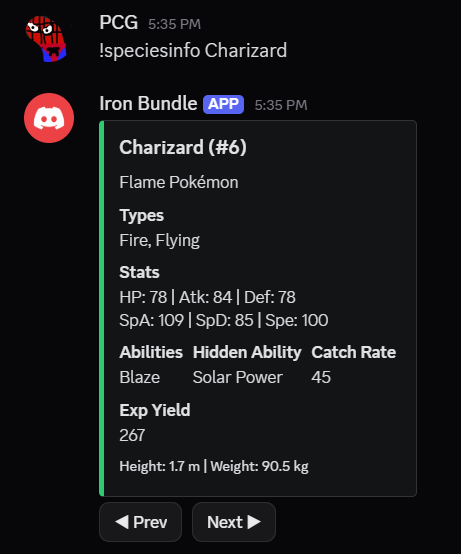
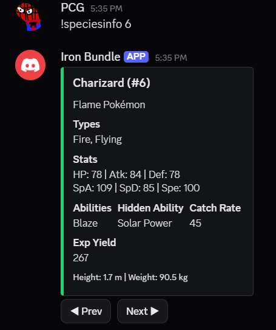
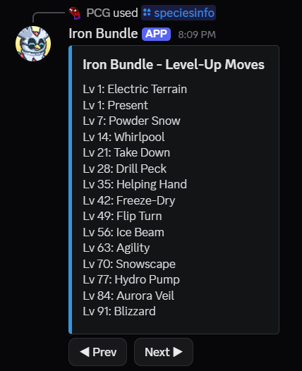
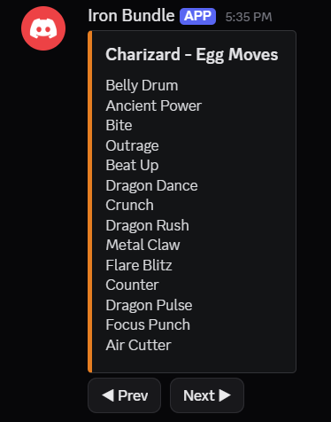
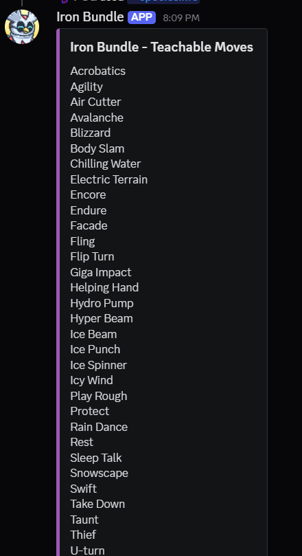

# Iron Bundle

Iron Bundle is a Pokedex-like Discord bot.

Run command `!speciesinfo <species_name>` or `!speciesinfo <natdex_num>` to check a Pokemon's information.

Eg:

`!speciesinfo Charizard`

`!speciesinfo 6`

Page 2: Level Up moves

Page 3: Egg moves

Page 4: Teachable (TM/Tutor) moves

More commands to come..!
