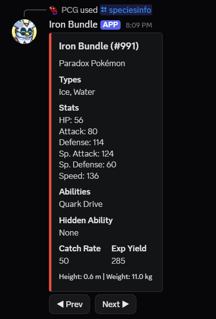

# Iron Bundle

Iron Bundle is a Pokédex-like Discord bot.

Run command `/speciesinfo <species_name>` or `/speciesinfo <natdex_num>` to check a Pokémon's information.

Eg:

`/speciesinfo query:Iron Bundle`

Page 2: Level Up moves

Page 3: Egg moves

Page 4: Teachable (TM/Tutor) moves

More commands to come..!
